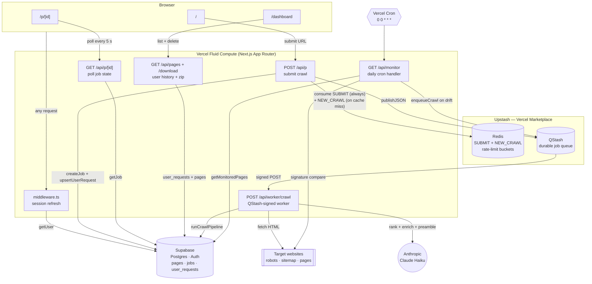
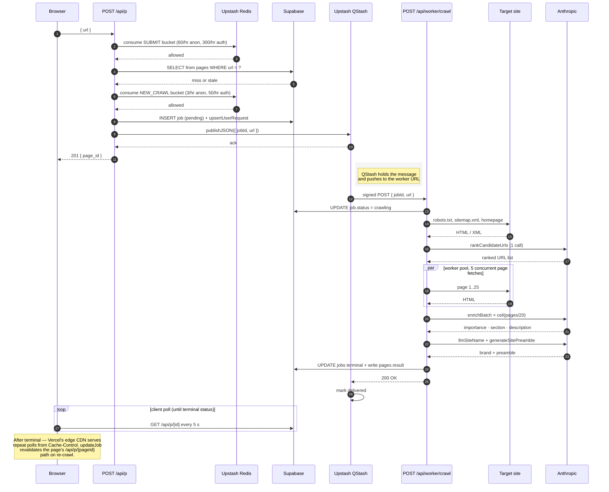

# llms.txt Generator — System Shape

Visual-first overview: component diagram, request lifecycle, and the
four pipeline stages the progress UI renders. Concrete thresholds,
config values, and rationale for the decisions below live in
[`DESIGN.md`](./DESIGN.md) — this file is the shape, that one is the
reasoning.

---

## 1. Component diagram

Every arrow is a real network call or module boundary in the codebase.

### How to read it

- **Browser** routes only reach Vercel Fluid Compute. They never touch Upstash / Anthropic / target sites directly.
- **`POST /api/p`** is the fast path: validate → charge SUBMIT bucket → canonicalize URL → check `pages` cache → attach-to-in-flight → charge NEW_CRAWL bucket → enqueue → return 201. The NEW_CRAWL charge only happens on the cache-miss branch, so repeat hits on popular URLs don't erode the tight Anthropic/Puppeteer budget guard. It never runs the crawl itself.
- **`POST /api/worker/crawl`** is where the actual work happens. Every arrow from the worker to an external service (`Supa`, `Web`, `Claude`) is inside one ~30–60 s function invocation.
- **`GET /api/monitor`** is a separate entrypoint that fans out into the same queue. The worker doesn't know whether a job came from a user submission or from the cron.
- **Upstash services** are provisioned through the Vercel Marketplace, so the env vars are auto-injected into Production + Preview. No secrets in the codebase.

---

## 2. Crawl request lifecycle

One user submission, end to end. Time flows top-to-bottom.

### Failure modes and retries

- **`POST /api/p` returns 5xx** — browser shows an error; nothing enqueued, nothing lost.
- **QStash publish fails** (network / auth / wrong region) — `lib/upstash/jobQueue.ts` catches and falls through to `waitUntil(runCrawlPipeline(...))`. Same Fluid Compute instance runs the crawl; no retry safety, but the crawl isn't dropped.
- **Worker returns non-2xx** — QStash redelivers with exponential backoff, up to `retries: 3`. The pipeline sets `job.status = crawling` at entry, so a retry overwrites rather than duplicates state.
- **Anthropic 429 / 5xx** — the Anthropic SDK retries transient failures with exponential backoff. If retries exhaust, the specific LLM step falls through to a deterministic fallback and the crawl still completes (degraded quality, no user-visible error). Tuning + rationale in [`SCALING.md §2`](./SCALING.md#2-where-we-hit-walls).
- **Fluid Compute instance recycled mid-crawl** — worker never returns 200 → QStash treats as failure → redelivers. Crawl re-runs from scratch.

---

## 3. Pipeline stages (what the progress UI shows)

One per progress-step the user sees. The four stages below match the four rows in `ProgressPane` exactly; this is what's happening inside each row while its spinner is active.

### 1 · Crawling pages

We start with nothing but a URL. This stage's job is to turn that into a small, deliberate list of pages we've fetched and parsed.

The first stop is `robots.txt` — partly to know which URLs we're allowed to touch, partly because it usually points at the site's sitemaps. Sitemaps are the fastest way to get a reasonable seed list, so we walk them (the robots-declared ones first, then the conventional `/sitemap.xml` fallbacks) and push every allowed same-domain URL into an in-memory queue.

Next we probe the homepage with a plain HTTP fetch. Plenty of sites are server-rendered HTML we can read directly; others are JavaScript shells that only become real HTML once a browser executes them. We have a one-way gate here: if the homepage fetch fails or the HTML looks like a JS shell, we switch to rendering everything through headless Chromium for the rest of the crawl. Staying on HTTP when we can is much faster; falling back to Chromium is what keeps us from returning an empty file on SPAs.

Before committing to a final list, we trim the queue. We cap how many URLs we'll take from any one section of the site, so a deep documentation subtree can't swamp the crawl. We detect the site's primary language and drop obvious off-locale prefixes like `/fr/`, `/de/`, `/ja/`. Then we hand the queue to the LLM and ask it to rank and trim — pick the URLs a reader of `llms.txt` would actually want.

Finally, a small worker pool fetches the ranked URLs in parallel, respecting `robots.txt` and politeness delays, and extracts title, headings, description, and a body excerpt from each page. One side errand also starts here: we kick off an LLM call to guess the site's brand name in parallel with the crawl, so stage 2 doesn't have to wait on it. The stage ends with an array of `ExtractedPage` records ready to enrich.

### 2 · Enriching with AI

Crawling gives us raw pages. Enriching turns them into something the scoring stage can actually reason about.

Three small signals get computed up front. The **brand name** is the LLM's pick from the homepage's `og:site_name`, `<title>`, h1, and hostname — this one was actually kicked off back during the crawl, so we just await it here instead of paying the latency sequentially. The **genre** is a deterministic label (docs site, shop, blog, marketing page, and so on) based on URL-path and homepage signals — later prompts use it to set tone and suggest section names. And **external references** are outbound links from the homepage that the LLM thinks belong in the output; we share the page budget between internal crawl results and these, so internal always wins the cap.

We also do a small de-duplication pass here: if a sub-page's meta description is literally the homepage tagline, we blank it out. Otherwise that same line repeats down the file and the output looks stuck on loop.

The expensive step is the per-page enrichment itself. We chunk pages into batches and send each batch to the LLM in parallel, asking for three fields per page: the section it belongs in, an importance score, and a short description. Batching is how we keep the stage cheap — a full crawl is one or two LLM calls here, not one per page. Batch size and page budget are in `lib/config.ts`.

### 3 · Scoring & classifying

This stage is pure TypeScript, no LLM calls. The enrichment map from stage 2 is one input; a handful of signals from the pages themselves is the other. For each crawled page we answer: does this belong in the final file, and if so, as a **Primary** entry or just an **Optional** one?

Every page gets a numeric score. Having a real meta description, a `.md` sibling (per the `llms.txt` spec), or structured data pushes it up. Pagination, tag / category / archive pages, and print-view URLs push it down. The LLM's importance rating contributes a meaningful swing on top. Pages whose URL path or `<html lang>` indicates a non-primary language take a soft penalty rather than getting filtered outright — it's a preference, not a rule. Exact weights and thresholds live in [`DESIGN.md §6`](./DESIGN.md#6-crawl-pipeline) and `lib/crawler/enrich/score.ts`.

Then we bucket: dropped, Optional, or Primary (try the LLM's suggested section first, fall back to path-regex inference). A final pass collapses URL variants the normalizer missed (`/foo` vs `/foo/index.html`, query-param duplicates) and caps the output. If both buckets come back empty — usually a tiny single-page site — we force the homepage into Optional so the resulting file isn't degenerate.

### 4 · Assembling file

Now it's just markdown construction. The `llms.txt` spec has a loose shape — an H1 with the site name, a blockquote summary, an intro paragraph, then `## Section` headings with bullet lists of links — and we fill each piece in order.

The **summary blockquote** comes straight from the homepage's meta description. If there isn't one, we leave the blockquote off entirely rather than substitute something weaker like an h2; a missing summary is better than a misleading one. The **intro paragraph** is a dedicated LLM call. The prompt asks for a JSON object with a `confident` flag, and if the model isn't confident, we drop the paragraph — this is how we keep the model's "I need more context" hedging out of the output. If `robots.txt` fully disallowed crawling, a single-line notice gets prepended so the reader knows why the file might look thin.

Each link line is `- [label](url): description`. Labels come from the page title when it's unique and distinct from the site name. When a title repeats across many pages (a very common SPA failure mode where `document.title` never updates) we fall back to a URL-derived label, and if there are still collisions we prefix the first differing path segment to break them.

The last thing this stage decides is the terminal status of the crawl — **complete**, **partial**, or **failed**. Exact rules in [`DESIGN.md §6`](./DESIGN.md#6-crawl-pipeline). That status is what the browser polls for and what shows up in the user's dashboard history.

---

## 4. Where each subsystem is documented

| Area | Doc |
|---|---|
| Full narrative design (data model, pipeline steps, trade-offs) | [`DESIGN.md`](./DESIGN.md) |
| Threat model + controls | [`SECURITY.md`](./SECURITY.md) |
| Phase-2 scaling work (shipped + planned) | [`SCALING.md`](./SCALING.md) |
| Theoretical throughput, ceiling math | [`PERFORMANCE.md`](./PERFORMANCE.md) |
| Error tracking + log visibility (Sentry + Vercel logs) | [`OBSERVABILITY.md`](./OBSERVABILITY.md) |
| Manual test playbook | [`TESTING.md`](./TESTING.md) |

---

## 5. What sits where in the repo

Full folder-by-folder breakdown lives in [`DESIGN.md §14`](./DESIGN.md). At the top level: `app/` for Next.js (routes + `app/api/*`), `lib/` for server code (`config.ts`, `store.ts`, `crawler/` pipeline organised by stage, `upstash/` + `supabase/` wrappers), `supabase/migration.sql` for the schema, and a handful of root-level config files (`middleware.ts`, `next.config.ts`, `vercel.json`, Sentry SDK init).
