# System Design

A visual overview. `docs/DESIGN.md` has the narrative; this file
exists so a reviewer can pattern-match the shape before reading prose.

---

## 1. Component diagram

Every arrow is a real network call or module boundary in the codebase.


### How to read it

- **Browser** routes only reach Vercel Fluid Compute. They never touch Upstash / Anthropic / target sites directly.
- **`POST /api/p`** is the fast path: validate → charge SUBMIT bucket → canonicalize URL → check `pages` cache → attach-to-in-flight → charge NEW_CRAWL bucket → enqueue → return 201. The NEW_CRAWL charge only happens on the cache-miss branch, so repeat hits on popular URLs don't erode the tight Anthropic/Puppeteer budget guard. It never runs the crawl itself.
- **`POST /api/worker/crawl`** is where the actual work happens. Every arrow from the worker to an external service (`Supa`, `Web`, `Claude`) is inside one ~30–60 s function invocation.
- **`GET /api/monitor`** is a separate entrypoint that fans out into the same queue. The worker doesn't know whether a job came from a user submission or from the cron.
- **Upstash services** are provisioned through the Vercel Marketplace, so the env vars are auto-injected into Production + Preview. No secrets in the codebase.

---

## 2. Crawl request lifecycle

One user submission, end to end. Time flows top-to-bottom.


### Failure modes and retries

- **`POST /api/p` returns 5xx** — browser shows an error; nothing enqueued, nothing lost.
- **QStash publish fails** (network / auth / wrong region) — `lib/upstash/jobQueue.ts` catches and falls through to `waitUntil(runCrawlPipeline(...))`. Same Fluid Compute instance runs the crawl; no retry safety, but the crawl isn't dropped.
- **Worker returns non-2xx** — QStash redelivers with exponential backoff, up to `retries: 3`. The pipeline sets `job.status = crawling` at entry, so a retry overwrites rather than duplicates state.
- **Anthropic 429 / 5xx** — the SDK's built-in retry handles it transparently. `lib/crawler/llmEnrich.ts` passes `maxRetries: llm.MAX_RETRIES` (5, up from the SDK default of 2) and `timeout: llm.CALL_TIMEOUT_MS` (60 s); exponential backoff and `Retry-After` honouring are the SDK defaults we rely on. 5 retries gives ~30 s of total backoff per call, still well inside the 270 s pipeline budget. If all 5 retries exhaust, the specific LLM step falls through to its deterministic fallback and the crawl still completes. A global LLM concurrency semaphore is the remaining follow-up called out in `SCALING.md` §3.
- **Fluid Compute instance recycled mid-crawl** — worker never returns 200 → QStash treats as failure → redelivers. Crawl re-runs from scratch.

---

## 3. Pipeline stages (what the progress UI shows)

One per progress-step the user sees. The four boxes match the four rows in `ProgressPane` exactly; this is what's happening inside each row while its spinner is active.

```mermaid
flowchart TD
    In(["Input: baseUrl"])
    Out(["Output: markdown llms.txt + status"])

    subgraph Crawling["1 · Crawling pages"]
        direction LR
        CR_RB["Read robots.txt<br/>→ disallow rules<br/>→ crawl-delay<br/>→ sitemap URLs"]
        CR_SM["Walk sitemaps<br/>up to 3 sources<br/>keep: same-domain<br/>· allowed · not skippable<br/>→ seed the BFS queue"]
        CR_HP["Probe the homepage<br/>plain HTTP, no browser"]
        CR_SPA{{"Needs a browser render?<br/>(fetch failed OR SPA shell)"}}
        CR_BR["Render with Chromium<br/>one page at a time<br/>hydrated JS reveals<br/>nav links we'd miss<br/>on plain HTTP"]
        CR_MD["Probe for a .md sibling<br/>per the llms.txt spec"]
        CR_NAV["Scrape homepage nav<br/>only on HTTP path<br/>when sitemap was sparse<br/>(queue < 5 URLs)"]
        CR_CAP["Cap URLs per section<br/>5 per 2-segment path prefix<br/>stops one area from flooding<br/>the rank prompt"]
        CR_LANG["Detect primary language<br/>from &lt;html lang&gt;<br/>defaults to 'en'"]
        CR_LOC["Drop non-primary locales<br/>e.g. /ar/ on an English site<br/>skipped if it would<br/>empty the queue"]
        CR_RANK["LLM ranks the queue<br/>picks the highest-value URLs<br/>for the 25-page budget"]
        CR_POOL[["Worker pool<br/>5 parallel on HTTP<br/>1 serial on Chromium"]]
        CR_W["For each URL:<br/>• respect politeness / crawl-delay<br/>• fetch + extract metadata<br/>• enqueue new links<br/>&nbsp;&nbsp;(until MAX_DEPTH)<br/>• flush progress (debounced 500 ms)"]
    end

    subgraph Enriching["2 · Enriching with AI"]
        direction LR
        EN_NAME["LLM picks the brand name<br/>from og:site_name, title,<br/>h1, JSON-LD<br/><i>kicked off in phase 1,<br/>awaited here</i>"]
        EN_GENRE["Classify the site genre<br/>docs · ecommerce · corporate ·<br/>news · blog · …<br/>pattern-match URLs + HTML"]
        EN_EXT["Gather external references<br/>from homepage outbound links<br/>• LLM picks worth keeping<br/>• fetch each for metadata<br/>budget = MAX_PAGES<br/>− internal pages crawled"]
        EN_STRIP["Blank out descriptions that<br/>just repeat the homepage tagline<br/>(keeps the preamble from<br/>echoing down the output)"]
        EN_BATCH["LLM enriches each page<br/>batches of 20, run in parallel<br/>→ section<br/>→ importance (1–10)<br/>→ description"]
    end

    subgraph Scoring["3 · Scoring & classifying"]
        direction LR
        SC_SCORE["Score each page 0–100<br/><br/><b>Base signals</b><br/>description +25<br/>mdUrl sibling +20<br/>JSON-LD description +10<br/>has headings +10<br/>body excerpt > 200 ch +10<br/><br/><b>Modifiers</b><br/>LLM importance → ±23<br/>off-primary-language → −20"]
        SC_SECT["Bucket each page<br/>score < 15 → dropped<br/>15–39 → Optional<br/>≥ 40 → LLM section<br/>&nbsp;&nbsp;(path-inferred fallback)"]
        SC_FILT["Pick what goes in the output<br/>• dedupe by host + path<br/>• drop site's own homepage<br/>• Primary: up to 50 (score ≥ 40)<br/>• Optional: up to 10 (15–39)<br/>• rescue homepage<br/>&nbsp;&nbsp;only if both are empty"]
    end

    subgraph Assembling["4 · Assembling file"]
        direction LR
        AS_SUM["Derive the summary blockquote<br/>from the homepage description<br/>(only if it came from<br/>meta / og / JSON-LD)"]
        AS_PRE["LLM writes a 2–3 sentence intro<br/>structured JSON reply with<br/>confidence flag<br/>dropped if not confident"]
        AS_NOTE["Add 'robots disallow-all' note<br/>when the site blocks all<br/>crawling (Disallow: /)"]
        AS_FILE["Build the markdown file<br/># SiteName<br/>> summary<br/>intro paragraph<br/>## Section<br/>&nbsp;&nbsp;- [label](url): description<br/>## Optional<br/><br/>label = page title, with<br/>URL-derived fallback on<br/>collision or generic title"]
        AS_TERM["Decide terminal status<br/>0 pages crawled → failed<br/>empty primary + optional → failed<br/>≥ 5 attempts && < 50 %<br/>&nbsp;&nbsp;success → partial<br/>else → complete"]
    end

    In --> CR_RB --> CR_SM --> CR_HP --> CR_SPA
    CR_SPA -- "needs Chromium" --> CR_BR --> CR_MD
    CR_SPA -- "HTML sufficient" --> CR_MD
    CR_MD --> CR_NAV --> CR_CAP --> CR_LANG --> CR_LOC --> CR_RANK --> CR_POOL --> CR_W
    CR_MD -. "kicked off here,<br/>awaited in Enriching" .-> EN_NAME
    CR_W --> EN_GENRE
    EN_NAME --> EN_EXT
    EN_GENRE --> EN_EXT --> EN_STRIP --> EN_BATCH
    EN_BATCH --> SC_SCORE --> SC_SECT --> SC_FILT
    SC_FILT --> AS_SUM --> AS_PRE --> AS_NOTE --> AS_FILE --> AS_TERM --> Out
```



### What each stage does

#### 1 · Crawling pages

Everything from "have a URL" to "have an array of fetched `ExtractedPage`s".

- **`fetchRobots`** — parse `robots.txt`. Two outputs that matter downstream: the Disallow list (honored on every enqueue) and the sitemap URLs (next step's seed). `Crawl-delay` is kept for the worker pool.
- **`fetchSitemapUrls × up to 3`** — robots-declared sitemaps first, then `/sitemap.xml` and `/sitemap_index.xml` as fallbacks. Each URL is run through `isSameDomain · !shouldSkipUrl · isAllowed` before being accepted into the in-memory BFS queue.
- **`fetchPage(baseUrl)` + SPA gate** — plain-HTTP probe of the homepage. If the fetch failed (403 / timeout / bot challenge) or the HTML looks like a JS shell (`isSpaHtml`), the gate flips to the browser path. This is a **one-way** decision: once flipped, every page in the worker pool goes through Puppeteer.
- **`SpaBrowser.init` + render homepage** — only runs on the browser path. The rendered DOM gives us the hydrated nav and any links the JS added post-load, which get merged into the in-memory BFS queue.
- **`probeMarkdown(baseUrl)`** — looks for a `.md` sibling of the URL (per the llms.txt spec). Contributes +20 to that page's score if found.
- **`extractLinksFromHtml` (homepage)** — only runs on the *non*-SPA path and only when the sitemap was sparse (queue < 5). Scrapes the homepage's nav as a safety net.
- **`capByPathPrefix`** — bounds the queue by the first `PREFIX_SEGMENT_DEPTH` (=2) path segments, at most `URLS_PER_PREFIX_CAP` (=5) per bucket. Stops a content-heavy section of the site from swamping the LLM rank prompt.
- **`primaryLang` + locale pre-filter** — reads `<html lang>`, defaults to `"en"`. Any URL whose leading path segment is a known ISO 639-1 code different from `primaryLang` is dropped. Has a safety floor: if the filter would empty the queue, it skips (so a site that's *only* locale-prefixed still produces output).
- **`rankCandidateUrls` (LLM)** — single Anthropic call. Takes the full queue + siteName + homepage excerpt + primaryLang and returns an ordered subset of URL indices. Output is deduped and used as the *new* queue order.
- **Worker pool** — pull-based; atomic `queueIdx++` under JS's single-threaded model. HTTP path: 5 parallel workers, each politeness-delayed by `POLITENESS_DELAY_MS + jitter` or the robots `Crawl-delay` slot (shared across workers). Browser path: 1 worker, paced by Puppeteer. Each successful page: `extractMetadata`, push to `pages[]`, and if `depth < MAX_DEPTH`, enqueue newly-discovered links. Progress writes to `jobs.progress` are debounced to 500 ms.

#### 2 · Enriching with AI

Turn the raw `ExtractedPage[]` into an enrichment map the scoring stage can use.

- **`llmSiteName`** — actually *started* back in phase 1, right before the worker pool awaits. Its only inputs are the homepage's name candidates (`og:site_name`, `<title>`, h1, JSON-LD) + hostname + deterministic guess. Running in parallel with the crawl saves ~5–10 s because the LLM call doesn't sit behind page fetches.
- **`detectGenre`** — deterministic. Pattern-matches URL paths (presence of `/docs/`, `/shop/`, etc.) and homepage HTML signals to bucket the site into one of the 23 genres in `types.ts`. Used by the enrichment + preamble prompts to set tone and section suggestions.
- **`resolveExternalReferences`** — homepage outbound anchors → `rankExternalReferences` LLM call picks which to include → each kept URL is fetched in parallel for its metadata. Budget = `MAX_PAGES − internalSuccessful.length`, so internal crawl always wins the cap. Failed fetches degrade to anchor-text-only entries.
- **Strip duplicate descriptions** — any sub-page that literally repeats the homepage's meta description gets its description blanked out. Prevents the preamble-ish homepage tagline from repeating down the output.
- **`llmEnrichPages`** — this is the per-page LLM pass. Pages are chunked into `ENRICH_BATCH_SIZE` (20), one Anthropic call per batch, batches run in parallel. Each response is a JSON array of `{ section, importance, description }` in the input order. With `MAX_PAGES = 25`, that's 1–2 calls here.

#### 3 · Scoring & classifying

Pure TypeScript — no LLM calls. Deterministic mapping from enrichment map → primary / optional.

- **`scorePages`** — computes a 0–100-ish score per page.
  - Base signals: `description present +25`, `mdUrl present +20`, `descriptionProvenance = json_ld +10`, `headings.length > 0 +10`, `bodyExcerpt.length > 200 +10`.
  - URL penalties: paginated `-15`, print/export `-20`, tag/category/archive `-25`.
  - LLM importance: `(importance − 5.5) × 5`, so range [−23, +23].
  - Off-primary-language penalty: `−20` when URL path locale or `<html lang>` indicates a non-primary language. Preference, not filter.
  - `isOptional` flag set when `score >= 15 && score < PRIMARY_SCORE_THRESHOLD` (40).
- **`assignSections`** — translates score + `llmSection` into a final section label.
  - `score < 15` → undefined (dropped from output).
  - `isOptional` or `score < 40` → "Optional".
  - Otherwise: LLM's section (if it returned one and it isn't "Optional"), else path-inferred fallback (`/docs/*` → "Docs", etc.).
- **`filterAndSelectPages`** — final selection.
  - Dedup by `host + path` (collapses `/foo` vs `/foo/index.html` and query-param variants the normalizer didn't strip).
  - Drop the site's own homepage (already represented by the `# siteName` H1).
  - Primary: `score >= 40 && section != "Optional"`, capped at 50.
  - Optional: `score ∈ [15, 40)`, capped at 10.
  - Single-page-site rescue: if both sets end up empty, surface the homepage as the one Optional entry so the file isn't degenerate.

#### 4 · Assembling file

Markdown construction + terminal-status decision.

- **Summary** — the first `> blockquote` line in the spec. Pulled from the homepage's `<meta name="description">` / `og:description` / JSON-LD `description`. Skipped if provenance was "none" (we'd rather have no summary than a h2-derived fallback here).
- **`generateSitePreamble` (LLM)** — the 2–3 sentence intro paragraph. Prompt asks for JSON `{ confident, reason, description }`; anything but `confident === true` drops the preamble (avoids the model's "I need more context" hedging landing in the output).
- **`robotsNotice`** — single-line warning prepended if `robots.txt` fully disallowed crawling; flags that the output only reflects what the homepage itself exposed.
- **`assembleFile`** — concatenates `# siteName`, `> summary`, preamble, then per-section `## <name>` blocks. Each line is `- [label](url): description`. Labels come from `page.title`, with URL-derived fallbacks when the title matches the site name or repeats across many pages (SPA that never updates `document.title`). Pass-2 disambiguation prefixes the first differing path segment to break collisions.
- **Terminal status decision** — `crawled = 0` or `primary + optional both empty` → **failed**; `attempted >= 5 && crawled/attempted < 0.5` → **partial**; otherwise **complete**. The failure path writes a scrubbed error ("browser render failed") that `scrubError` later maps to a user-friendly "We couldn't render this site."

---

## 4. Where each subsystem is documented

| Area | Doc |
|---|---|
| Full narrative design (data model, pipeline steps, trade-offs) | [`DESIGN.md`](./DESIGN.md) |
| Threat model + controls | [`SECURITY.md`](./SECURITY.md) |
| Phase-2 scaling work (shipped + planned) | [`SCALING.md`](./SCALING.md) |
| Theoretical throughput, ceiling math | [`PERFORMANCE.md`](./PERFORMANCE.md) |
| Error tracking + log visibility (Sentry + Vercel logs) | [`OBSERVABILITY.md`](./OBSERVABILITY.md) |
| Manual test playbook | [`TESTING.md`](./TESTING.md) |

---

## 5. What sits where in the repo

```
app/
  page.tsx + LandingClient.tsx   landing, with server-resolved auth state
  dashboard/                     page history, delete, monitor status
  p/[id]/                        result viewer + poll loop
  login/                         OAuth entry
  api/
    p/                           POST submit, GET poll, DELETE history
    pages/                       history list + zip export
    monitor/                     daily cron handler
    worker/crawl/                QStash-signed worker (the actual crawl host)
  auth/callback/                 OAuth return

lib/
  config.ts                      all tunable constants
  store.ts                       Supabase access layer
  rateLimit.ts                   two-bucket (SUBMIT + NEW_CRAWL) Upstash Redis + in-memory fallback
  jobQueue.ts                    QStash publish + waitUntil fallback
  supabase/{client,server}.ts    Supabase client factories
  crawler/
    pipeline.ts                  orchestration — the one function the worker calls
    {robots,sitemap,fetchPage,
     safeFetch,readBounded,
     canonicalUrl,ssrf,
     spaCrawler,discover,extract,
     markdownProbe,classify,
     genre,score,group,
     llmEnrich,assemble,
     siteName,urlLabel,
     monitor,validate}.ts        individual pipeline stages
  env.ts, log.ts                 env + logger helpers (log.ts forwards Errors to Sentry)

instrumentation.ts               Next.js register hook — loads Sentry server/edge init
instrumentation-client.ts        Sentry browser SDK init (on-error replay)
sentry.server.config.ts          Node runtime init + ignoreErrors filter
sentry.edge.config.ts            Edge runtime init (for middleware)
app/global-error.tsx             App Router root error boundary → Sentry
supabase/migration.sql           full schema + RLS
middleware.ts                    session refresh + /dashboard gate
next.config.ts                   CSP + security headers + withSentryConfig wrapper
vercel.json                      function durations + cron schedule
```
