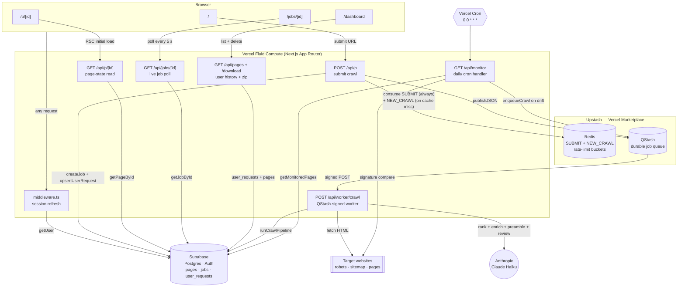

# llms.txt Generator — System Shape

Visual-first overview: component diagram, request lifecycle, and the
four pipeline stages the progress UI renders. Concrete thresholds,
config values, and rationale for the decisions below live in
[`DESIGN.md`](./DESIGN.md) — this file is the shape, that one is the
reasoning.

---

## 1. Component diagram

Every arrow is a real network call or module boundary in the codebase.



### How to read it

- **Browser** routes only reach Vercel Fluid Compute. They never touch Upstash / Anthropic / target sites directly.
- **`POST /api/p`** is the fast path: validate → charge SUBMIT bucket → canonicalize URL → check `pages` cache → attach-to-in-flight → charge NEW_CRAWL bucket → enqueue → return 200 (cache hit) or 201 (new crawl). Cache hits respond `{ page_id, cached: true }` and the client routes to `/p/{page_id}`; in-flight attaches and new crawls respond `{ page_id, job_id, cached: false }` and the client routes to `/jobs/{job_id}` for live progress. The NEW_CRAWL charge only happens on the cache-miss branch, so repeat hits on popular URLs don't erode the tight Anthropic/Puppeteer budget guard. It never runs the crawl itself.
- **`POST /api/worker/crawl`** is where the actual work happens. Every arrow from the worker to an external service (`Supa`, `Web`, `Claude`) is inside one ~30–60 s function invocation.
- **`GET /api/monitor`** is a separate entrypoint that fans out into the same queue. The worker doesn't know whether a job came from a user submission or from the cron.
- **Upstash services** are provisioned through the Vercel Marketplace, so the env vars are auto-injected into Production + Preview. No secrets in the codebase.

---

## 2. Crawl request lifecycle

One user submission, end to end. Time flows top-to-bottom.

```mermaid
sequenceDiagram
    autonumber
    participant U as Browser
    participant P as POST /api/p
    participant R as Upstash Redis
    participant DB as Supabase
    participant Q as Upstash QStash
    participant W as POST /api/worker/crawl
    participant T as Target site
    participant A as Anthropic

    U->>P: { url }
    P->>R: consume SUBMIT bucket (60/hr anon, 300/hr auth)
    R-->>P: allowed
    P->>DB: SELECT from pages WHERE url = ?
    DB-->>P: miss or stale
    P->>R: consume NEW_CRAWL bucket (3/hr anon, 50/hr auth)
    R-->>P: allowed
    P->>DB: INSERT job (pending) + upsertUserRequest
    P->>Q: publishJSON({ jobId, url })
    Q-->>P: ack
    P-->>U: 201 { page_id, job_id, cached: false }
    note over U: Browser routes to /jobs/{job_id}<br/>which polls status below.

    rect rgb(245,245,245)
        note right of Q: QStash holds the message<br/>and pushes to the worker URL
    end

    Q->>W: signed POST { jobId, url }
    W->>DB: UPDATE job.status = crawling

    W->>T: robots.txt, sitemap.xml, homepage
    T-->>W: HTML / XML

    W->>W: dropParametricFanout + capByPathPrefix (URL filter)
    W->>A: rankCandidateUrls (1 call)
    A-->>W: ranked URL list

    par worker pool, 5 concurrent page fetches
        W->>T: page 1..25
        T-->>W: HTML
    end

    W->>A: enrichBatch × ceil(pages/20)
    A-->>W: importance · section · description
    W->>A: llmSiteName + generateSitePreamble
    A-->>W: brand + preamble
    W->>A: llmFinalReview (assembled draft)
    A-->>W: drop_urls · moves · section_order · relabel

    W->>DB: UPDATE jobs terminal + write pages.result
    W-->>Q: 200 OK
    Q->>Q: mark delivered

    loop client poll on /jobs/{id} (until terminal status)
        U->>DB: GET /api/jobs/[id] every 5 s
    end

    note over U: On terminal success — /jobs/{id} client<br/>router.replace's to /p/{pageId}. The /p/{id}<br/>RSC reads /api/p/[id], which is edge-cached;<br/>updateJob revalidates that path on re-crawl.
```

### Failure modes and retries

- **`POST /api/p` returns 5xx** — browser shows an error; nothing enqueued, nothing lost.
- **QStash publish fails** (network / auth / wrong region) — `lib/upstash/jobQueue.ts` catches and falls through to `waitUntil(runCrawlPipeline(...))`. Same Fluid Compute instance runs the crawl; no retry safety, but the crawl isn't dropped.
- **Worker returns non-2xx** — QStash redelivers with exponential backoff, up to `retries: 3`. The pipeline sets `job.status = crawling` at entry, so a retry overwrites rather than duplicates state.
- **Anthropic 429 / 5xx** — the Anthropic SDK retries transient failures with exponential backoff. If retries exhaust, the call site throws `LlmUnavailableError`, which the pipeline's outer catch converts to a `failed` job with a user-facing "AI service is unavailable" message. The pipeline does not fall back to deterministic-only output, because shipping a heuristic file labelled as a real result would mislead the user. Tuning + rationale in [`SCALING.md §2`](./SCALING.md#2-where-the-design-hits-walls).
- **Fluid Compute instance recycled mid-crawl** — worker never returns 200 → QStash treats as failure → redelivers. Crawl re-runs from scratch.

---

## 3. Pipeline stages (what the progress UI shows)

One per progress-step the user sees. The four stages below match the four rows in `ProgressPane` exactly; this is what's happening inside each row while its spinner is active.

### 1 · Crawling pages

The pipeline starts with nothing but a URL. This stage's job is to turn that into a small, deliberate list of fetched and parsed pages.

The first stop is `robots.txt` — partly to know which URLs are allowed, partly because it usually points at the site's sitemaps. Sitemaps are the fastest way to get a reasonable seed list, so the pipeline walks them (the robots-declared ones first, then the conventional `/sitemap.xml` fallbacks) and pushes every allowed same-domain URL into an in-memory queue.

Next, the homepage is probed with a plain HTTP fetch. Plenty of sites are server-rendered HTML readable directly; others are JavaScript shells that only become real HTML once a browser executes them. There's a one-way gate here: if the homepage fetch fails or the HTML looks like a JS shell, the rest of the crawl renders through headless Chromium. Staying on HTTP when possible is much faster; falling back to Chromium is what keeps the file from coming back empty on SPAs.

Before committing to a final list, the queue is trimmed. A per-section cap stops a deep documentation subtree from swamping the crawl, and within each capped bucket the shorter-path URL wins (the section index over individual leaf pages). The site's primary language is detected and obvious off-locale prefixes like `/fr/`, `/de/`, `/ja/` are dropped. Then the queue goes to the LLM for ranking — pick the URLs a reader of `llms.txt` would actually want. The LLM is required; if the call fails (no API key, billing exhausted, transport error after SDK retries), the pipeline raises `LlmUnavailableError` and the job lands as `failed` with a clear message instead of degrading to a heuristic-only crawl.

Finally, a small worker pool fetches the ranked URLs in parallel, respecting `robots.txt` and politeness delays, and extracts title, headings, description, and a body excerpt from each page. One side errand also starts here: an LLM call to guess the site's brand name fires in parallel with the crawl, so stage 2 doesn't have to wait on it. The stage ends with an array of `ExtractedPage` records ready to enrich.

### 2 · Enriching with AI

Crawling produces raw pages. Enriching turns them into something the scoring stage can actually reason about.

Three small signals get computed up front. The **brand name** is the LLM's pick from the homepage's `og:site_name`, `<title>`, h1, and hostname — kicked off during the crawl, awaited here instead of paying the latency sequentially. The **genre** is a deterministic label (docs site, shop, blog, marketing page, and so on) based on URL-path and homepage signals — later prompts use it to set tone and suggest section names. **External references** are outbound links from the homepage that the LLM thinks belong in the output; the page budget is shared between internal crawl results and these, with internal always winning the cap.

A small de-duplication pass also runs here: if a sub-page's meta description is literally the homepage tagline, it's blanked out. Otherwise that same line repeats down the file and the output looks stuck on loop.

The expensive step is the per-page enrichment itself. Pages are chunked into batches and each batch is sent to the LLM in parallel, asking for three fields per page: the section it belongs in, an importance score, and a short description. Batching keeps the stage cheap — a full crawl is one or two LLM calls here, not one per page. Batch size and page budget are in `lib/config.ts`.

### 3 · Scoring & classifying

This stage is pure TypeScript, no LLM calls. The enrichment map from stage 2 is one input; a handful of signals from the pages themselves is the other. For each crawled page, the scorer answers: does this belong in the final file, and if so, as a **Primary** entry or just an **Optional** one?

Every page gets a numeric score. Having a real meta description, a `.md` sibling (per the `llms.txt` spec), or structured data pushes it up. Pagination, tag / category / archive pages, and print-view URLs push it down. The LLM's importance rating contributes a meaningful swing on top. Pages whose URL path or `<html lang>` indicates a non-primary language take a soft penalty rather than getting filtered outright — it's a preference, not a rule. Exact weights and thresholds live in [`DESIGN.md §6`](./DESIGN.md#6-crawl-pipeline) and `lib/crawler/enrich/score.ts`.

Then bucketing: dropped, Optional, or Primary (the LLM's suggested section is tried first, falling back to path-regex inference). A final pass collapses URL variants the normalizer missed (`/foo` vs `/foo/index.html`, query-param duplicates) and caps the output. If both buckets come back empty — usually a tiny single-page site — the homepage is forced into Optional so the resulting file isn't degenerate.

### 4 · Assembling file

Now it's just markdown construction. The `llms.txt` spec has a loose shape — an H1 with the site name, a blockquote summary, an intro paragraph, then `## Section` headings with bullet lists of links — and the assembler fills each piece in order.

The **summary blockquote** comes straight from the homepage's meta description. If there isn't one, the blockquote is left off entirely rather than substituted with something weaker like an h2; a missing summary is better than a misleading one. The **intro paragraph** is a dedicated LLM call. The prompt asks for a JSON object with a `confident` flag; if the model isn't confident, the paragraph is dropped — this keeps the model's "I need more context" hedging out of the output. If `robots.txt` fully disallowed crawling, a single-line notice gets prepended so the reader knows why the file might look thin.

Each link line is `- [label](url): description`. Labels come from the page title when it's unique and distinct from the site name. When a title repeats across many pages (a very common SPA failure mode where `document.title` never updates), the assembler falls back to a URL-derived label, and if collisions remain it prefixes the first differing path segment to break them.

Once the draft is assembled, one more LLM call (`llmFinalReview`) hands the **whole rendered file** to the model and asks four questions: are any entries clear noise that should be dropped given the rest of the file, do any entries belong under a different section (a misclassified item, or a singleton section that should be consolidated into a topically-adjacent larger one), is the section ordering right for an llms.txt (foundational sections first, catalogue / news / blog later), and are there any link labels that read awkwardly (run-together URL slugs like "Getstarted", URL-derived fallbacks)? Reading the assembled file at once lets the model catch what per-page enrichment can't see — login-redirect URLs, individual catalogue items the section index already covers, descriptions that just repeat the preamble. The model returns `{ drop_urls, moves, section_order, relabel }`; the file is re-assembled with the moves applied first (so new section names introduced by consolidation participate in `section_order`), the drops applied, the LLM-supplied section order honored over the avg-score sort, and any per-URL label rewrites overriding the deterministic resolver. A parse error or empty edit response is a silent no-op so the draft survives unchanged; transport failures (no API key, billing exhausted, exhausted SDK retries on 5xx / 429) throw `LlmUnavailableError` and surface the job as `failed`.

The last thing this stage decides is the terminal status of the crawl — **complete**, **partial**, or **failed**. Exact rules in [`DESIGN.md §6`](./DESIGN.md#6-crawl-pipeline). That status is what the browser polls for and what shows up in the user's dashboard history. Counts are taken AFTER the final-review drops, so a review that pruned every entry surfaces as failed instead of producing an empty file.

---

## 4. Where each subsystem is documented

| Area | Doc |
|---|---|
| Full narrative design (data model, pipeline steps, trade-offs) | [`DESIGN.md`](./DESIGN.md) |
| Threat model + controls | [`SECURITY.md`](./SECURITY.md) |
| Phase-2 scaling work (shipped + planned) | [`SCALING.md`](./SCALING.md) |
| Theoretical throughput, ceiling math | [`PERFORMANCE.md`](./PERFORMANCE.md) |
| Error tracking + log visibility (Sentry + Vercel logs) | [`OBSERVABILITY.md`](./OBSERVABILITY.md) |
| Manual test playbook | [`TESTING.md`](./TESTING.md) |

---

## 5. What sits where in the repo

Full folder-by-folder breakdown lives in [`DESIGN.md §14`](./DESIGN.md). At the top level: `app/` for Next.js (routes + `app/api/*`), `lib/` for server code (`config.ts`, `store.ts`, `crawler/` pipeline organised by stage, `upstash/` + `supabase/` wrappers), `supabase/migration.sql` for the schema, and a handful of root-level config files (`middleware.ts`, `next.config.ts`, `vercel.json`, Sentry SDK init).
